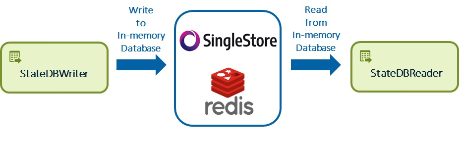
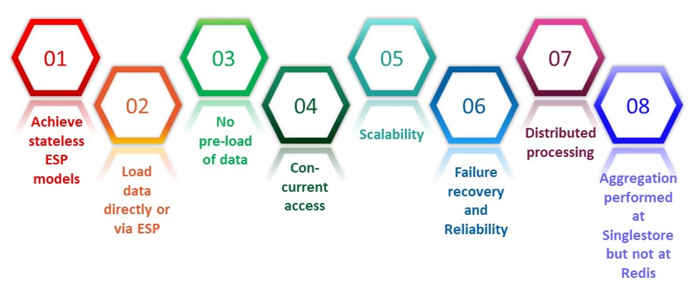
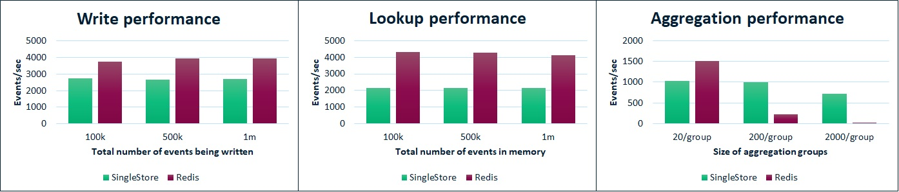

# SAS ESP integration with In-memory Databases for State and Data Persistence

## Contents
1. [Overview](#overview)
2. [Understanding SAS Event Stream Processing in Kubernetes](#understanding-sas-event-stream-processing-in-kubernetes)
3. [Challenges](#challenges)
4. [Introduction to ESP StateDB Windows](#introduction-to-esp-statedb-windows)
    * [Deep Dive into the Architecture of StateDB Windows](#deep-dive-into-the-architecture-of-statedb-windows)
5. [When to use external in-memory databases with ESP](#when-to-use-external-in-memory-databases-with-esp)
    * [Limitations](#limitations) 
6. [Reference Architectures](#reference-architectures)
7. [Benefits of Using ESP StateDB Windows](#benefits-of-using-esp-statedb-windows)
8. [Performance Evaluation](#performance-evaluation)
9. [Sample use-cases to understand migration to StateDB windows](#sample-use-cases-to-understand-migration-to-statedb-windows)
10. [Demos](#demos)
11. [Additional References](#additional-references)

## Overview

Have you ever been in a situation where the internal memory of [SAS Event Stream Processing (ESP)](https://go.documentation.sas.com/doc/en/espcdc/v_030/espwlcm/home.htm) was not sufficient to store all the data? Have you faced a time-consuming recovery of ESP from a failure due to the recreation of the internal state? Have you thought of having an external unlimited in-memory database to handle the limited internal memory issues? If yes is your answer to all these questions, then you are at the right place.

In ESP, indexes are used to store the state of the windows in the ESP XML model. Indexes are saved in the internal memory of the ESP server pod which is assigned at the deployment time. The following windows maintain state in the internal memory:

1. An ESP Aggregate Window is used for performing aggregation over a defined retention period which can be long or short.

2. An ESP Join Window is used to perform a lookup against a whitelist/reference data.
These windows store the aggregated data and result of the join operation in the internal memory. This works well when the join is performed over a small reference data and aggregation is performed where the retention period is small. 

In situations where we need to compute aggregated data over a long retention period and find a record amidst millions of records (reference data), we cannot continue to use the internal memory. Along with that, each ESP server pod will have to maintain data in the in-memory and the state will be lost upon server failure. Restoring the state can be a time-consuming process when a huge volume of data is involved. Additionally, the reference data which could be millions of records (user data) must be uploaded to the internal memory of every ESP server pod. If we have scaling pods, a good amount of time will be consumed to upload the reference data to the memory which will delay the processing of events by the ESP server pod. 

In this project, we present two new [ESP StateDB windows](https://go.documentation.sas.com/doc/en/espcdc/v_030/espcreatewindows/n01c9h6p6pmlcmn11w46am1xgnum.htm) StateDB Reader and StateDB Writer to integrate with Singelstore and Redis in-memory databases. We will present how we can solve the above-mentioned issues. You will also learn about the various benefits of this new architecture for persisting state and data using in-memory databases.

**NOTE: We provide integration with Singlestore and Redis in-memory databases only.**

## Understanding SAS Event Stream Processing in Kubernetes

Before jumping into the introduction and architecture of StateDB windows, it is important to understand how ESP runs in Kubernetes. 

According to the new ESP paradigm:

1.	Each ESP server pod runs one and only one ESP XML Project.
2.	Each ESP server has its dedicated resources, i.e., CPU and Memory. These resources are provided in the deployment settings when deploying the project from SAS Event Stream Manager.
3.	ESP server pods scale based on the CPU and memory metrics to handle the incoming events. The auto-scaling parameters, i.e., max and min replicas are also provided in the deployment settings.
4.	ESP XML Projects can be Stateless and Stateful.

## Challenges
In ESP, join, aggregation, and rolling aggregation operations are performed with very high throughput and very low latency. The data aka state maintained in the join or aggregation windows are stored in the internal RAM of the ESP server pods. In some use cases, if the volume of the state is huge, then relying on the internal memory can be very expensive.

Moreover, ESP works on distributed scalable architecture where we have multiple interconnected nodes and ESP server pods run in these nodes. At any point, a node can crash which subsequently crashes all the running pods on that node. It is important to ensure the reliability, fault tolerance, and failure recovery of the ESP server pods. When we have stateful ESP XML projects, it further becomes challenging to handle and manage the states maintained in the internal memory of the ESP server pods in the event of node or pod failure/crash. 

Following are the limitations to using ESP internal memory for performing memory-intensive operations like join/lookup over millions of records (reference data), simple aggregation, multiple aggregations, or rolling aggregation with a high retention period and high volume of data.

1.	**Limited RAM:** RAM assigned to ESP is limited and cannot be scaled vertically while the ESP server pod is running. In that case, we are bound to have only that much data that our internal memory can handle.
2.	**Slow and time-consuming pre-load of data:** For a high volume of reference data that can be in millions, pre-loading all these records to ESP server pods can be very slow and expensive.
3.	**Reprocessing of events in case of failure:** In case of ESP failure, we have to reprocess a lot of events to get back to the same state.
4.	**Slow auto-scaling due to pre-loading of RAM:** For auto-scaling stateful models, whenever a new ESP server pod would join, it has to be pre-loaded with the reference data. The pre-load of data would take time before the ESP server can start processing the incoming events.

These limitations are not acceptable in many situations as reprocessing, pre-loading, and limited RAM would add to the latency and reduce the throughput.

## Introduction to ESP StateDB Windows
To overcome the above challenges and limitations, we integrate ESP with external in-memory databases to ensure the reliability and failure recovery of XML projects along with state and data persistence.

Hereby, we introduce you to the ESP StateDB windows that are capable of communicating with the [Singlestore](https://www.singlestore.com/) and [Redis](https://redis.com/) in-memory databases. These windows can read and write events, reference/whitelist data, results from aggregation operations, and also perform lookups. Additionally, the ESP XML models can now be designed stateless as all the state and data are persisted in the in-memory databases. 

Let’s look into the details of the ESP StateDB windows.

### Deep Dive into the Architecture of StateDB Windows

In this section, we will learn about the new ESP StateDB Windows. We have introduced two different ESP windows that integrate with high-performance, low-latency in-memory databases, that are Singlestore and Redis as shown in Figure 1. Today, we integrate with Singlestore and Redis only. 

The two windows are: 
1.	ESP StateDB Writer Window
2.	ESP StateDB Reader Window

<figure align="center">
  
  <figcaption><i>Figure 1. ESP Integration with Singlestore and Redis via ESP StateDB Windows</i></figcaption>
</figure>

Let’s have [a deep dive into the architectural designs](statedb_windows_architecture/statedb_windows_arch.md) of these windows. We will also learn how these windows communicate with Singlestore and Redis. 

## When to use external in-memory databases with ESP

1.	**High Volume of Data:** When the reference/historic/dimension/whitelist (whatever you call it) data is in many thousands or millions of records and we need to perform lookup operations. It can be a single entity/record search or multiple. It makes sense, to offload the high volume to external in-memory databases rather than keeping it in the ESP server pod's internal memory.

2.	**Large Retention Periods:**  When we perform aggregation operations over a large volume of data with high retention periods which could span for days or months, you must consider using external in-memory databases. Because high retention periods mean that you need to keep the aggregated results in the memory for a longer period. We likely go out of internal memory for such huge volumes. External in-memory databases make the most sense when both high-volume and high-retention periods are there. 

3.	**Failover:**  Best scenario for failover is when the ESP Models are stateless. Failover is complex and time-consuming when the ESP server pod’s internal memory is used to maintain the state and store the data. In case of failure, we will lose both the state and data from the internal memory. To have a quick recovery from failure, without any need to reprocess the events to create the state again, we must use external in-memory databases for persisting state and data. Therefore, whenever the ESP server pod would crash/fail, a new one that replaces it can fetch both the state and data from the external in-memory database and resume.   

4.	**Scalability:** We often encounter fluctuating workloads. To handle the fluctuating incoming number of events, it is important for ESP to auto-scale to continue to provide the same throughput. This is only possible with the deployment of ESP in Kubernetes. Additionally, having stateDB windows is essential for persisting the state and data. Both Singlestore and Redis allow concurrent accesses and can scale both horizontally and vertically if required. 

5.	**Join and Aggregation Operations:** As previously mentioned, it makes sense to maintain the states of these operations in external in-memory databases. With this, scalable models can share states and data and perform operations in parallel without interfering with each other. 

### Limitations

There are two limitations that must be considered when using the architecture with the ESP StateDB windows. 

1.	**Increased Latency:** We have to have over-the-network communication with the external in-memory databases and this can bring some additional latency, which in most cases is within the acceptable range. Also, the speed of databases can limit the throughput on ESP server pods. This can be worked out with the proper configuration of Singlestore and Redis. **If having very low latency is critical to your application, then consider using ESP memory instead of StateDB.**

2.	**No state/data management for Pattern, Geofence, MAS:** In case of a failure, state, and data for ESP Pattern, Geofence & MAS windows will be lost. Currently, we have no integration of these with external in-memory databases. Therefore, they continue to use the ESP internal memory allocated at runtime in deployment settings.

## Reference Architectures

We have reference architecture designs that integrate with the ESP StateDB Windows. [In this section](reference_architectures/reference_architectures.md), you will learn about these architectures, their characteristics, benefits, and limitation. These architectures are deployed in a Kubernetes environment running in a public/private cloud or on-premises platforms and use the [Lightweight SAS Event Stream Processing (ESP) Kubernetes Operator Framework](https://go.documentation.sas.com/doc/en/espcdc/v_030/espex/titlepage.htm). 

Following are the three reference architectures with ESP StateDB Windows:

1.	[Stateless ESP Projects Using In-memory DB for Persisting State and Data](reference_architectures/reference_architectures.md#stateless-esp-projects-using-in-memory-db-for-persisting-state-and-data): Architecture where individual ESP server pods integrate with Singlestore and Redis for persisting state and data.

2.	[Scalability of ESP Server Pods with Kafka using In-Memory Database for State and Data Persistence](reference_architectures/reference_architectures.md#scalability-of-esp-server-pods-with-kafka-using-in-memory-database-for-state-and-data-persistence): Architecture where ESP server pods autoscale with Kafka and concurrently access Singlestore and Redis

3.	[Multiple Cascading Projects with Message Buses and DB integration](reference_architectures/reference_architectures.md#multiple-cascading-projects-with-message-buses-and-in-memory-database-integration): Architecture with cascading ESP projects (projects interconnect using messages buses) where any of these projects can autoscale and connect to in-memory Databases

## Benefits of Using ESP StateDB Windows
Figure 2 illustrated the key benefits of using ESP StateDB Windows for state and data persistence rather than relying/using the ESP server pods internal memory. 

<figure align="center">
  
  <figcaption><i>Figure 2. Benefits of Using ESP StateDB Windows</i></figcaption>
</figure>

1. **Achieve stateless ESP models.** Integration with StateDB Windows allows having stateless ESP models for join and aggregation operations. However, it is not yet possible for other windows like pattern, geofencing, and MAS.

2.  **Reference data loaded directly or via ESP to in-memory DB.** All the reference/whitelist/dimension data can be preloaded either via the ESP model or directly. Any mechanism can be used to upload the data into the in-memory database. 

3.  **No pre-load of data.** There is no need to pre-load the data as the internal memory is not used for storing the reference data anymore. Data is loaded into the DB and shared across all. 

4.  **Concurrent access.** All the data and state are maintained and persisted at the in-memory DB which is concurrently accessible by all the ESP server pods. Configuration for managing concurrent access must be done at the database level during its deployment. 

5.  **Scalability.** ESP server pods can autoscale and all of them can access the configured in-memory database allowing high throughput. 
 
6.  **Failure Recovery and Reliability.** No need of spending hours in failure recovery because no state is lost during a failure. 

7.  **Distributed processing.**  All ESP servers can process incoming events in parallel. This is only possible because of the shared state and data in the in-memory DB.

8.  **Aggregation performed at Singlestore but not at Redis.** It is very important to note that aggregation is performed right at the Singlestore which is not the case with Redis. Redis will fetch all the matching records and then bring them to the window and then perform the aggregation. 

## Performance Evaluation
Figure 3 demonstrates the performance evaluation of Singlestore VS Redis for write, lookup, and aggregation operations. This clearly shows when we should use Singlestore and when Redis. 

*Setup:* Both Singlestore and Redis are running in a cluster configuration of 3 nodes in Kubernetes.  It was a simple, most basic configuration recommended in the documentation of each of these in-memory databases. *Please note that these evaluations should not be considered as benchmark performance.* 

<figure align="center">
  
  <figcaption><i>Figure 3. Performance Evaluation of ESP StateDB Windows for Write, Lookup and Aggregation Operations</i></figcaption>
</figure>

1.	**Write Performance.** When the total number of events written to both databases was up to 1 million, Redis surpasses Singlestore. Therefore, if the rate of incoming events to the ESP is fast then Redis must be configured.

2.	**Lookup Performance.** When the total number of records in the in-memory databases was 1 million, and a one-to-one search/lookup was performed, Redis again outshines Singlestore. Redis showcased almost double the performance of Singlestore. 

3.	**Aggregation Performance.** Test was conducted with 3 sizes of aggregation groups, i.e., 20, 200, and 2000 records per group. Redis excelled when the aggregation group size was smaller. With the increase in aggregation group size, which means more records to aggregate, we notice that Singlestore starts to perform way better than Redis. When the group size was 2000, Redis was incredibly slow and performed very poorly. 

So, based on these evaluations, whenever the use-case demands write and lookup operations with small groups of aggregation, Redis is the right choice. But, if the aggregation group size is huge, one must opt for Singlestore. 

## Sample use-cases to understand migration to StateDB windows
In this [section](sample-use-cases/sample-use-cases-to-understand-migration-to-statedb-windows.md) we present use cases that can act as reference to migrate your existing approach to a StateDB based approach. Go through the section to understand the potential issues with your current approaches related to Lookup, Aggregation and Multiple Retention implementation in ESP and how StateDB windows can help in solving them.

## Demos
[In this section](demos/demos.md), you will have the opportunity to run some sample examples. 

## License
> This project is licensed under the SAS License Agreement for Corrective Code or Additional Functionality.

## Additional References
* [Documentation of SAS Event Stream Processing](https://go.documentation.sas.com/doc/en/espcdc/v_030/espwlcm/home.htm)
* [Video on SAS ESP State Management Using In-Memory Databases](http://sas-social.brightcovegallery.com/sharing?videoId=6255425305001)
* [ESP StateDB Windows Documentation](https://go.documentation.sas.com/doc/en/espcdc/v_030/espcreatewindows/n01c9h6p6pmlcmn11w46am1xgnum.htm)
* [Deployment scripts for Standalone ESP (lightweight) Deployment](https://github.com/sassoftware/esp-kubernetes)
* [Kubernetes Monitoring Stack for SAS Event Stream Processing on Kubernetes](https://github.com/sassoftware/iot-kubernetes-monitoring-esp)
* [Deploying Viya 4 with SAS ESP](https://github.com/sassoftware/viya4-deployment)
* [SAS® Viya® Monitoring for Kubernetes](https://github.com/sassoftware/viya4-monitoring-kubernetes)
* [GitHub SAS Software for other SAS repositories](https://github.com/sassoftware)
* [SAS Communities for demos, customer stories, products know-how, enablement contents and other supports](https://communities.sas.com/)

