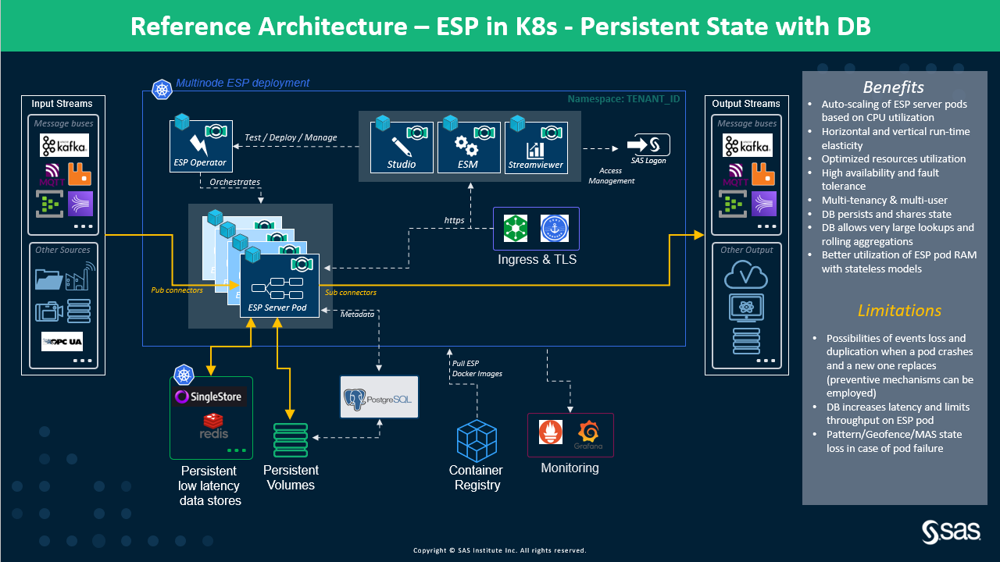
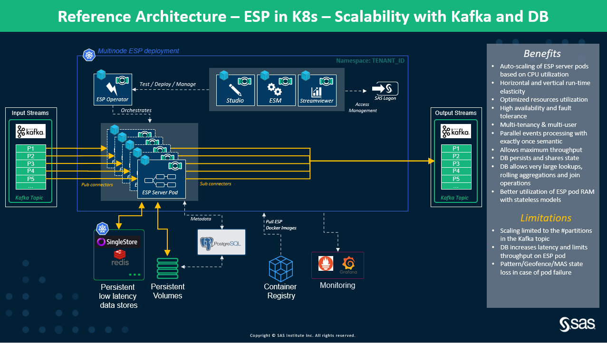
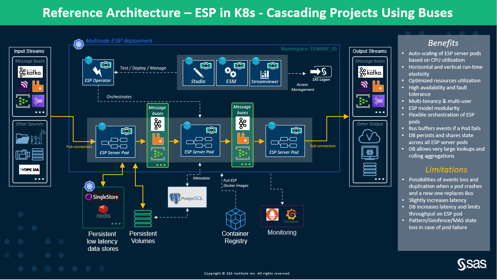

# Reference Architectures
This section covers all the architectures corresponding to integration with external in-memory databases, primarily, Singlestore and Redis for persisting state and data. It also covers the auto-scaling ESP server pod architectures with concurrent access to databases.

## Stateless ESP Projects Using In-memory DB for Persisting State and Data

### Description
Figure 1 illustrates how ESP server pods connect to the low latency, high throughput in-memory database using a SAS ESP StateDB Windows in the ESP XML projects. As mentioned previously, operations like aggregation over long retention periods, and lookup from reference/dimension/whitelist data with millions of records, can benefit from Singlestore and Redis in-memory databases for data and state persistence. Processed events are persisted in the database. In the event of a crash, the state continues to persist in the in-memory database which is also shared among all the other ESP server pods accessing the database. Additionally, when a new ESP server pod replaces the crashes pod, it fetches the latest state from the DB and resumes processing. If there are some duplicates, their processing can be skipped by using the database to know if they have been processed earlier or not.

 
     
    <em>Figure 1. High-Level Architecture for Stateless ESP Projects Using DB for Persistent State and Data</em>

Learn from the [Video on SAS ESP State Management Using In-Memory Databases](http://sas-social.brightcovegallery.com/sharing?videoId=6255425305001)

### Characteristics
1. All ESP servers pods can connect to the in-memory databases using the StateDB Reader and Writer Windows.
2. StateDB Reader Window allows reading the data from the in-memory database while StateDB Writer Window allows writing to the database.
3. The persisted state and data aids in fast recovery from the failure. No time-consuming state buiding exercise as the state is always persists (at every event).
4. Allows performing very large lookups and rolling aggregations.
5. This architecture provides better utilization of ESP pod RAM with stateless models.

### Limitations
1. Currently, we we only support SingleStore and Redis.
2. There is some additional latency due to communication over the network with the in-memory data store.
3. There are possibilities of event loss and duplication when a pod crashes and a new one replaces. However, some mechanisms can be implemented to prevent this. 
4. Access to the external in-memory databases increases the latency and limits throughput on the ESP server pod/(s). However, performance degradation is within the acceptable range. 
5. Pattern/Geofence/MAS windows, if used, continue to lose state in case of pod failure. Currently, there is no way to handle these states using external in-memory databases.

## Scalability of ESP Server Pods with Kafka using In-Memory Database for State and Data Persistence

### Description
Figure 2 demonstrates the high level architecture of acheiving scalability of ESP server pods using Kafka. The scaling ESP server pods share the same consumer group to pull the data from the same Kafka topic which can have one or many partitions. With Kafka, we ensure that all the ESP server pods are processing incoming events with only-once semantic, i.e., events/messages are processed only once.

 
     
    <em>Figure 2. Scalability of ESP Server Pods with Kafka using In-Memory Database for State and Data Persistence</em>

During the events of ESP server pod crash or failure, Kafka undergoes rebalancing which means reassignment of partitions to the running ESP server pods. This ensures that the remaining ESP server pods continue to serve all the events from all the partitions in the Kafka topic. Kafka rebalances whenever an ESP server pod joins or leaves a consumer group.

Kafka allows management of the offsets with which we can configure from what point in the topic or partition, the messages must be replayed to prevent any data loss. During the replay, there are chances that some events might get reprocessed. But, ESP XML project can be designed to handle/reject the duplicate events or they can be simply ignored if the use case allows.

Additionally, all the auto-scaling ESP server pods can concurrently access Singlestore and Redis.

### Characteristics
1. Use of in-memory databases for persisting state and data allow the ESP XML projects to be completely stateless. Therefore, no worries of losing data in the internal memory of the pods.
2. The architecture has high availability, failover, and resiliency.
3. No message loss and duplicates (if any) can be easily handled with the help of in-memory databases.
4. Kafka allows auto-scaling ESP server pods using the consumer group access the events/messages from the configured Kafka topic.
5. Kafka provides configurable retention policy, i.e., storing the messages/events in the topics durably and reliably for as long as you want.
6. Kafka allows management of the offsets with which we can configure from what point in the topic, the messages must be replayed to prevent any data loss.
7. During the replay action, there might be some events that will get reprocessed. Rejecting the duplications events from getting reprocessed can be handled in the ESP model or completely ignored.

### Limitations

1. In-memory databases configuration, management, and orchestration need to be taken care of separately just like Kafka.
2. Having an in-memory database means additional cost.
3. Concurrent access to the in-memory database also bring some performance degradation due to communication over the network.
4. Number of scaling ESP server pods is limited by the number the of partitions in the topic from which ESP server pods are consuming the events using the same consumer group.
5. For handled duplicate events from getting reprocessed, a mechanism needs to set up which would need a persistent volume to maintain the state to know which all events have been processed previously. This volume must be shared among all the ESP server pods for state and data sharing.
6. If any state is maintained in the ESP server pod internal memory, then during an episode of crash and failure, the state would be lost. This can lead of expensive and time consuming recovery by replaying all the events once again to get back to the state.
7. This architecture is useful for small retention periods which are in a few minutes, if a stateful project is in consideration.

## Multiple Cascading Projects with Message Buses and in-memory database integration

### Description

Figure 3 shows how we can have cascading ESP server pods (where each of them runs a different ESP XML project) using the message buses such as Kafka, RabbitMQ, Amazon Kinesis, Azure Event Hubs, Azure IoT Hubs, etc. Here the ESP server pod writes its output to the message bus which is the input for the next ESP server pod. There can be multiple ESP server pods reading and writing to the intermediate message buses.

 
     
    <em>Figure 3. High-Level Architecture for Multiple Cascading Projects Using Message Buses and integrating with in-memory databases in K8s</em>

This approach is very useful in situations where we want to break a big ESP XML project into multiple projects and where some of these ESP projects can be scalable. Message buses ensure there is no event/data loss when during the travel from one ESP server pod to another. Additionally, the message buses allow ESP server pods to consume streaming events at their own pace without interfering with the functionality of the other ESP server pods.
NOTE: Using message buses brings in some additional latency. Thorough performance testing must be conducted to ensure that the latency is within the acceptable performance requirement SLO ranges (especially for mission-critical use-cases).

### Characteristics

1. With Message buses, we can connect any number of ESP XML projects with each other.
2. This architecture allows having a mix of scalable and non-scalable ESP sub-projects.
3. We can have combinations of message buses if required and fits the use-case required. This architecture gives the flexibility of using multiple messages buses (of different types).
4. The message buses can be deployed on the same K8s cluster or different. We only have to ensure that we can access the message buses from the ESP server pods running in the K8s cluster.
5. Message buses like Kafka, Amazon Kinesis, etc. provides a configurable retention policy so that the events/data can be stored for longer durations. This allows the consumer ESP server pods to access the data at their own pace.

### Limitations

1. These message buses are 3rd party software and have to be configured and managed by the customers/partners. They are free to choose any message bus, be it managed or unmanaged. SAS does not provide any support for message buses management.
2. Customers/Partners must ensure that message buses are configured for high availability, failover, and resiliency as they will play an important role in data/events transfer between ESP sub-projects.
3. Using message buses incurs cost overhead.

**NOTE:** For all the architectures described above, we can use [Prometheus and Grafana for monitoring, dashboarding and visualization](https://github.com/sassoftware/viya4-monitoring-kubernetes).

