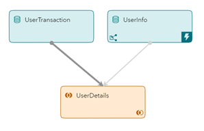
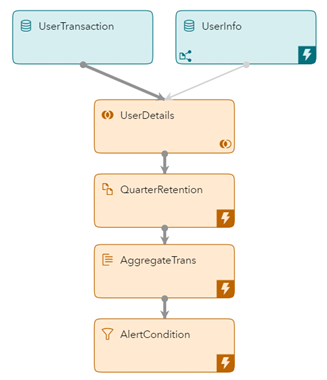
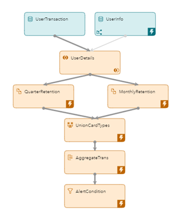
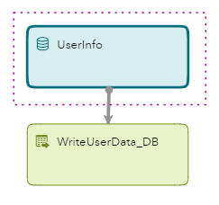
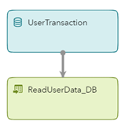
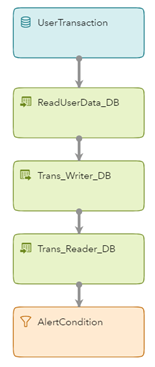
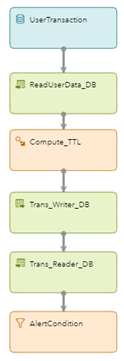

# SAS ESP StateDB Windows typical use cases

* [Introduction](#introduction)
* [Hypothetical Usecases Without StateDB Windows](#hypothetical-usecases-without-statedb-windows)
  - [Use case 1: Lookup](#use-case-1-lookup)
  - [Use case 2: Aggregation](#use-case-2-aggregation)
  - [Use case 3: Multiple Retention](#use-case-3-multiple-retention)
* [Solution for the Above Mentioned Issues](#solution-for-the-above-mentioned-issues)
* [Hypothetical Usecases with StateDB Windows](#hypothetical-usecases-with-statedb-windows)
   - [Use case 1: Lookup](#use-case-1-lookup-1)
   - [Use case 2: Aggregation](#use-case-2-aggregation-1)
   - [Use case 3: Multiple Retention](#use-case-3-multiple-retention-1)
* [Conclusion](#conclusion)

## Introduction
SAS Event Stream Processing (ESP), as the name suggests, is SAS’s product for processing and analyzing streaming data, called events, for real-time analytics. ESP provides natively great features for doing streaming joins, lookups, aggregations, and rolling aggregations with very high throughput and very low latency. In streaming terms, all these are Stateful operations where the events need to be stored. ESP stores the historical and other events it needs to perform the above tasks in RAM which provides it with the kind of performance it is known for.

This section presents the hypothetical use cases to demonstrate how ESP works with and without StateDB Windows.

## Hypothetical Usecases Without StateDB Windows
Let's consider a hypothetical company called ESP Bank.  The ESP Bank has millions of credit card customers. The bank wants to upgrade its infrastructure for handling any checks or alerts they want to have for a credit card transaction by a customer. Since this is a critical operation, their service needs to be always available. Also, it needs to handle transactions from multiple customers at the same time.

### Use case 1: Lookup
When a customer does a transaction, the system should fetch the details of the customer like the Customer Name, Phone Number, and category of the Card (like Standard or Platinum).

This is a very classic requirement that is seen in many domains like banking, telecom, customer intelligence, and even in some IoT use cases.

If this use case needs to be implemented in ESP without StateDB Windows, then we would have a model as below.

 
     
    <em>Figure 1: Usecase1: Tradition approach for Lookup</em>

Understanding the Model:

1.	`UserTransaction` is the streaming data source getting an event for each transaction done by the user.
2.	`UserInfo` is the dimension source of the data which will load all the user information from a database and keep it in ESP internal memory.
3.	`UserDetails` is a *Streaming Left Outer join* with details like username, phone number, and card type being added to the streaming data.

#### Potential Issues
Now let's look at the issues with this approach.

1. Since all the user information is fetched at the start of the ESP project, those events need to be stored in the ESP RAM. The number of events run into millions. To handle this volume of data a higher configuration of RAM is required to implement this requirement.
2. Another thing to consider is the time to load all the dimension data into the ESP internal memory from a database (in most cases) at the start of the ESP project. So, the volume of data will drive the loading time and thus the time before ESP could be ready to ingest and process the streaming data.
3. In case of failover, the new ESP project started due to the failure recovery will again go through the whole process of reloading the dimension data. This makes the full recovery a slow process and dependent on the dimension data.
4. Autoscaling also becomes challenging and time-consuming in such a scenario because of the pre-loading of dimension data. Autoscaling involves starting new ESP server pods to handle the load.

### Use case 2: Aggregation
ESP bank wants to monitor any high-value transaction done by the user in a quarter. It wants to apply some basic intelligence for that. So, the bank employs a rule. If the current transaction amount of the customer is twice the average transaction amount done by the customer in that quarter, they should alert the user on his mobile number.

Let's extend the above ESP model to handle this requirement in ESP without using the StateDB Windows.

 
     
    <em>Figure 2: Usecase2: Tradition approach for Aggregation</em>

The model is similar to the model of Usecase1 in Figure 1. However, there are some new ones for this requirement.

1. `QuarterRetention` is a *Copy window* with a retention of 90 days.
2.	`AggregateTrans` returns the *Sum* of the number of transactions including the current one for the customer along with the number of transactions done.
3.	`AlertCondition` is a *Filter Window* that does a simple calculation to check the alert requirement and passes only those events which match the alert condition.

#### Potential Issues
All the problems discussed in UseCase 1 apply here including some new ones. Let’s look at them.

1.	Apart from the dimension data, all the transaction events are also stored in ESP's internal memory. These transaction events are used by the Aggregate window to calculate the aggregated values.
2.	In case of a failure, the state of the Aggregate window is regenerated. This means all the historical transactions must pass through the model again when a new ESP server pod is started after the failure.
3.	Scaling up can be an issue too. Apart from regenerating all the state information, it is necessary to ensure that the transactions are going to the correct ESP server pod.

### Use case 3: Multiple Retention
ESP bank has two different categories of cards, Standard and Premium. For Standard card customers, the bank wants to monitor the high-value transaction (as in the usecase described above) but for a monthly period.  For Premium card customers, the period remains as a quarter. So, if the current transaction amount of the Standard card customer is twice the average transaction amount done by the customer in a month, they should alert the user on the mobile number. The same is done with Premium Card customers but quarterly. The flow of data is the same for both requirements. The only difference is the retention period of the events.

We will simply extend the above model to achieve the requirement without using the StateDB window.

 
     
    <em>Figure 3: Usecase3: Tradition approach for Multiple Retention</em>

The model will be like the one above. This is just a bit modified version of Use case 2 above.
1.	`UserDetails` output is split based on `CardType` using a splitter expression.
2.	`MonthlyRetention` is a *Copy window* with a retention of 90 days.
3.	`UnionCardTypes` combines the events of different card types where the events have different retentions.

#### Potential Issues
All the problems discussed in Usecase 2 still apply here including some new ones along with the following ones:

1.	Each card type will need to have a separate Copy Window to apply different retentions.
2.	When a new card type is added, then another Copy window has to be added. This could be done only by stopping, modifying, and then restarting the project. Therefore, compromising the availability of the stream processing.

## Solution for the Above Mentioned Issues
With version 2021.2.6 (April 2022 Stable release), ESP introduced [StateDB windows](https://go.documentation.sas.com/doc/en/espcdc/v_030/espcreatewindows/n01c9h6p6pmlcmn11w46am1xgnum.htm). The windows allow leveraging an external high-performance, low latency in-memory databases for storing and maintaining data and state required for joins and aggregations without storing them in ESP internal memory.

Let's see how we handle the above mentioned issues with ESP StateDB windows.

## Hypothetical Usecases with StateDB Windows
We consider the same ESP bank usecase here as well. ESP bank wants to upgrade their infrastructure to ESP in Viya 4 and use the ESP StateDB windows to fix the above challenges. Let's see how ESP StateDB windows are used to handle the above mentioned problems.

### Use case 1: Lookup
When a customer does a transaction, the system should fetch the details of the customer like the Customer Name, Phone Number, and category of the Card (like Standard or Platinum).
When this use case is implemented in ESP with StateDB Windows, the windows integrate with an in-memory Database, either Redis or SingleStore to store the state information. The approach to model building changes a bit. Figure 6 presents the model.

 
     
    <em>Figure 6: Usecase1: Writing With StateDB</em>

In this case, the ESP model to fetch data from a traditional database and write it to an in-memory DB. Such a model can be used independently to load the reference/whitelist/dimension data to in-memory database. However, one must make sure that it runs and finishes the data loading before the streaming data comes in. The model can be designed to scaleup to perform concurrent writes to the database. 

This model is like the one above.
1.	`UserInfo` is the dimension data which will load all the user information from a database/CSV/Kafka etc.
2.	`WriteUserData_DB` is the StateDB writer window that loads all the user data to the in-memory DB along with the metadata (if any).

 
     
    <em>Figure 7: Usecase1: Reading With StateDB</em>

The ESP model in Figure 7 can be an independent project. The model fetches (performs lookup) the records from the in-memory database for the corresponding user in the transaction event. 

Here is the model description:
1.	`UserTransaction` is the streaming data source to get an event for each transaction done by the user.
2.	`ReadUserData_DB` is the ESP StateDB reader window. It does a lookup for a matching user in the database and fetches the user details. The details are then added to the streaming data.

In this case, data is stored in the in-memory database which makes the ESP models run stateless. 

The following are the advantages of this model:

#### Advantages
1. Loading the user info data to the in-memory database is an independent ESP Model. As previously mentioned, it can be designed to scale up (if necessary). *NOTE: The user info data can be loaded externally. Make sure you follow the ESP criteria for data*. 
2. You must ensure that the Writer project has already finished writing all the records to the in-memory database before the reader project starts. 
3. With this model, we do not store the user info data in the internal memory of the ESP server pod. Therefore, in case of an ESP failover, the new ESP server pod can immediately start processing the streaming events. Both data and state are persisted in the database. *NOTE: for high-availability implementation, the in-memory database installation should support high availability too*.
4. All the ESP projects can connect to the database independently and concurrently. Both data and state are shared across all the running ESP server pods. Therefore, all ESP projects can auto-scale seamlessly.

## Use case 2: Aggregation
ESP bank wants to monitor any high-value transaction done by the user in a quarter. It wants to apply some basic intelligence for that. So, the bank employs a rule. If the current transaction amount of the customer is twice the average transaction amount done by the customer in that quarter, they should alert the user on his mobile number.

We will extend the ESP streaming model with StateDB reader window (Figure 2) for this requirement. In Usecase 1, we showed how the StateDB writer and reader windows can run in separate projects. 
However, it is also possible to have both windows in the same model as shown the Figure 8.

 
     
    <em>Figure 8: Usecase2: Aggregation With StateDB</em>

We have additional windows in this model in comparison to the model in Figure 2:

1.  `Trans_Writer_DB` is the *StateDB Writer window*. It writes the transaction events to the in-memory database with a Time-To-Live (TTL) of 90 days. It also creates the secondary index per user for the aggregations that we require in this model.
2.  `Trans_Reader_DB` window fetches the matching transaction for the user in the incoming event and aggregates the values. The output from this window consists of the sum of all the balances along with the number of fetched records. This helps in getting the condition for generating the alerts.
3.  `AlertCondition` is a *Filter Window* that does a simple calculation to check the alert requirement It passes only those events which match the alert condition.

In this case, all the transactions are stored in the in-memory database which keeps the ESP models stateless. In addition to the advantages discussed earlier, below are some more:

#### Advantages
1. The transactions are written to the in-memory database. This means the ESP model doesn’t store them in the internal RAM. The model can fetch the transactions whenever required from the in-memory database.
2. In case of an ESP failure, historical transaction information is not lost.
3. For autoscaling models, aggregations are not an issue because the records required for aggregations are fetched from the in-memory database which is shared across all the ESP models.

The model above shows how in the same model we can first write and then read the records. It is also possible, to do vice-versa, i.e., read first and then write.

### Use case 3: Multiple Retention
ESP bank has two different categories of cards, Standard and Premium. For Standard card customers, the bank wants to monitor the high-value transaction (as in the usecase described above) but for a monthly period.  For Premium card customers, the period remains as a quarter. So, if the current transaction amount of the Standard card customer is twice the average transaction amount done by the customer in a month, they should alert the user on the mobile number. The same is done with Premium Card customers but quarterly. The flow of data is the same for both requirements. The only difference is the retention period of the events.

We will modify the ESP streaming model (shown in Figure 3) with StateDB reader window with aggregation. 

 
     
    <em>Figure 9: Usecase3: Mutliple retention With StateDB</em>

Figure 9 demonstrates the ESP model. Following are the modifications in the ESP windows of usecase 2 (Figure 3).
1.  `Compute_TTL` calculates the TTL value in the number of seconds based on the card type and adds the value as *ttl field* in the outgoing event schema.
2.  `Trans_Writer_DB` reads the value from the *ttl field* and sets the Time-To-Live value of the records being written to the database.

In addition to the advantages of using StateDB windows that we have discussed earlier, the following are the advantages of handling retention of the events in StateDB windows.

#### Advantages
1.  The copy window retention is not required anymore, which makes the ESP model stateless.
2.  No need to have multiple Copy windows to use hardcoded retention values. The retention period can be different for each event which can be set in the incoming event as one of the fields *‘retention_period’*.
3.  If the retention period is part of the schema of an incoming event, then in the future if new categories like Cardtype are added, there is no need of modifying the model. 

**IMPORTANT NOTE: The retention provided by the StateDB windows out of the box is a time-based sliding window retention.**

## Conclusion
The sample use cases here are similar to some of the use cases that have been encountered multiple times in different forms in different industries. You can use these ESP models with StateDB windows reference or starting point to solve your business problems.

