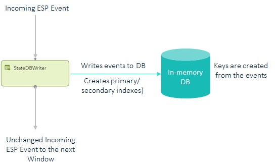
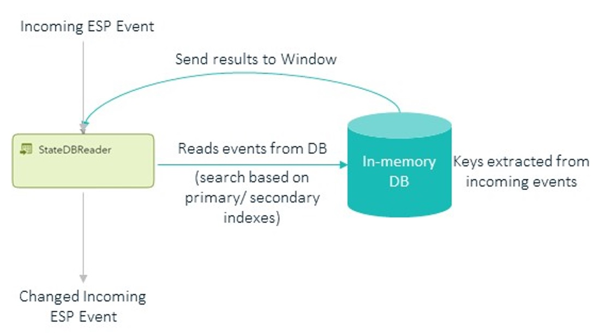

# Deep Dive into the Architecture of StateDB Windows

In this section you will learn:

* [Architecture Design of ESP StateDB Writer Window](#architecture-design-of-esp-statedb-writer-window)
* [Architecture Design of ESP StateDB Reader Window](#architecture-design-of-esp-statedb-reader-window)

## Architecture Design of ESP StateDB Writer Window

The ESP StateDB Writer Window is used to write the incoming events to the defined in-memory database. Its primary 3 main operations are:

1.  Write an incoming event to the external in-memory databases.
2.  Create the required indexes for the event.
3.  Pass the input event unchanged to the next window of the ESP project.

Figure 1 demonstrates the high-level architecture of the ESP StateDB writer window.

 
     
    <em>Figure 1. High-level Architecture of ESP StateDB Writer Window</em>

The StateDB writer window, at the time of initialization, writes metadata to the in-memory DB. The metadata includes the key formed from multiple key fields of input event schema. This metadata is used by the StateDB reader window to form the key from incoming event fields to fetch data.
The StateDB writer window forms the primary index from the incoming event key fields and writes the data as Key-Value pair to the in-memory database.

The StateDB windows also support secondary index searches. This is used in case of aggregations or for fetching one-to-many records. The writer window creates the secondary index whenever required.
The output of the StateDB writer window is the same as the input event passed through the window.

## Architecture Design of ESP StateDB Reader Window

The StateDB Reader window is used to query or fetch data from the defined external in-memory database based on the incoming event and specified criteria. Its basic operations are:

1.  Lookup records in the database based on matching criteria fetched from the incoming event.
2.  Give aggregate values based on set properties.
3.  Fetch multiple matching records for an incoming event and pass them as ESP events.

Figure 2 demonstrates the high-level architecture of the ESP StateDB reader window.

 
     
    <em>Figure 2. High-level Architecture of ESP StateDB Reader Window</em>

The StateDB reader window, at the time of initialization, fetches the metadata from the in-memory database. The metadata consists of semicolon-separated key fields. This information helps in deciding whether the window is being used for lookup which is a one-to-one search or a one-to-many search.

If it is a one-to-one search then the StateDB reader window extracts the fields specified in the metadata for creating the primary index and then uses this primary index to fetch the matching record. The output event is created from the fields of the incoming event and the matched record found in the in-memory database.

In case of aggregation or one-to-many search, the reader window fetches multiple records from the database using the secondary index. If aggregation must be done, then the window uses the specified function to create the aggregated value which is then added to the output event. If one-to-many events are obtained, then multiple output events are created which is a combination of data fetched from the database and the input event. In this case at least one of the fields fetched from the database should be part of the key fields of the output event.
