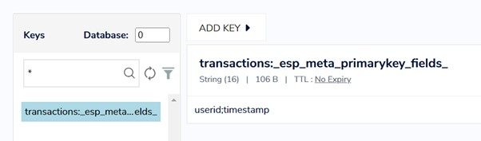
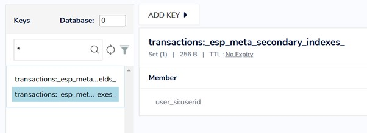
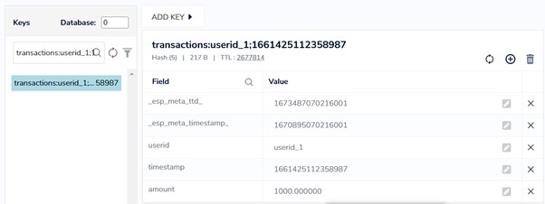
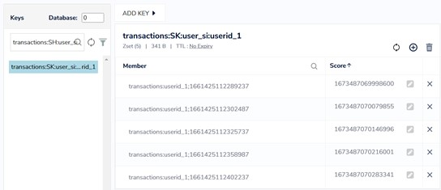
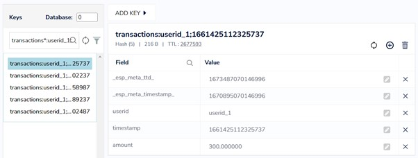
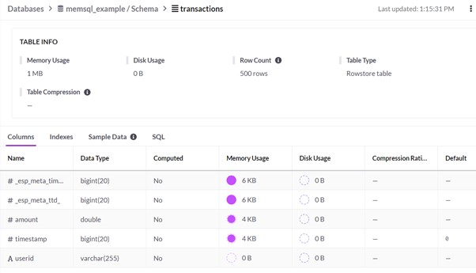
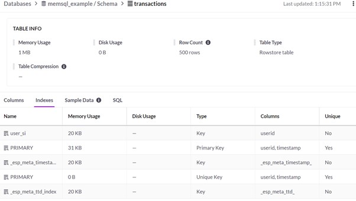
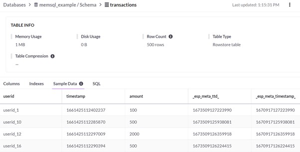

# The Architecture of StateDB Windows

<!-- TOC start -->
- [Introduction](#introduction)
- [High Level Design](#high-level-design)
  * [ESP StateDB Writer Window](#esp-statedb-writer-window)
  * [ESP StateDB Reader Window](#esp-statedb-reader-window)
- [StateDB Windows Architecture](#statedb-windows-architecture)
- [StateDB Windows Architecture for Redis](#statedb-windows-architecture-for-redis)
  * [StateDB Writer Window](#statedb-writer-window)
    + [Metadata](#metadata)
    + [Data](#data)
    + [Deleting expired records and entries](#deleting-expired-records-and-entries)
  * [StateDB Reader Window](#statedb-reader-window)
    + [Lookup](#lookup)
    + [Aggregation ](#aggregation)
    + [One-to-Many Events](#one-to-many-events)
- [StateDB Windows Architecture for SingleStore](#statedb-windows-architecture-for-singlestore)
  * [StateDB Writer Window](#statedb-writer-window-1)
    + [Deleting expired rows](#deleting-expired-rows)
  * [StateDB Reader Window](#statedb-reader-window-1)
    + [Lookup](#lookup-1)
    + [Aggregation](#aggregation-1)
    + [One-to-Many Events](#one-to-many-events-1)
- [Conclusion](#conclusion)
<!-- TOC end -->

## Introduction
StateDB Windows allow ESP to interact with an in-memory database to offload the ESP state and access it whenever required. This allows ESP projects to run stateless. **Currently, we only support Redis and Singlestore.** 

In this article, we will look in detail at how StateDB windows interact internally with Redis and SingleStore. The integration with Redis and SingleStore are implemented differently as they are two different types of datastores. Redis is an in-memory key-value data store while SingleStore is an in-memory relational database. This section will first show at a high level how the integration happens followed by deep dive into the details of the integration with both the datastores.

**Note: The content of this article is based on ESP version Stable Release 2022.12. Future enhancements and optimizations can affect the architecture.**

## High Level Design
ESP has a pair of StateDB windows, i.e., ESP StateDB Writer window and ESP StateDB Reader window. As their name suggests, the writer window writes the data to the datastore while the reader window reads the data. This is a very simplified way of explaining the operations of the windows. The windows do more than just write and read the data. The below section presents the high-level designs of each of these windows.

### ESP StateDB Writer Window
Figure 1 demonstrates the high-level design of the ESP StateDB Writer Window that is used to write the incoming events to the defined in-memory database. 

<p align="center">
 
    <br>
    <em>Figure 1: High-level Design of ESP StateDB Writer Window</em>
</p>

At a high level, the StateDB Writer Window has 3 main operations:

1.	Write an incoming event to an external in-memory database.
2.	Create the required indexes, primary or secondary, from the fields of the incoming event in the database to assist reading.
3.	Pass the input event unchanged to the next window of the ESP project.

### ESP StateDB Reader Window
The StateDB Reader window is used to fetch data from the defined external in-memory database based on the incoming event and specified query. The window supports the following operations driven by the various set properties:

1.	Lookup records in the database based on matching criteria fetched from the incoming event.
2.	Give aggregate values based on set properties.
3.	Fetch multiple matching records for an incoming event and pass them as ESP events to the next window in the ESP XML model.

The figure below demonstrates the high-level architecture of the ESP StateDB reader window.

<p align="center">
 
    <br>
    <em>Figure 2. High-level Architecture of ESP StateDB Reader Window</em>
</p>

At a high level, the State DB Reader window fetches 0, 1, or more records from the datastore based on the query property set for the window. The output event depends on the query and will include fields fetched from the datastore or their aggregated values.

## StateDB Windows Architecture
As mentioned previously, the ESP StateDB windows at present support Redis and SingleStore as the datastores to store the ESP state information. Since both the datastores are different from each other in their approach to storing and retrieving data, our architecture to integrate with them differs significantly. In this section, we will provide the details of how the StateDB windows integrate with the supported datastores. This can be helpful information if you have to decide between the two datastores.

## StateDB Windows Architecture for Redis
Redis is a fast, open-source, in-memory, key-value database. It is one of the most popular key-value databases because of its simplicity and low latency performance.

Next, we will look individually at how ESP StateDB Writer and Reader windows are integrated with Redis.

### StateDB Writer Window
All the data in Redis is stored as key-value pair. The value can be any of the different data structures provided by Redis. Out of the multiple data structures supported by Redis, ESP at present uses strings, sorted sets, and hashes for the integration.

Let’s take a sample StateDB writer window for our reference in the following section:

```xml
<window-statedb-writer name="StateDBWriter">
  <statedb type="redis" cluster="false" hostname="punevmsinjoy04" port="6379"/>
  <write prefix="transactions" ttl="2592000" ttl-offset="86400">
    <secondary-indexes>
      <secondary-index name="user_si">
        <fields>
          <field name="userid"/>
        </fields>
      </secondary-index>
    </secondary-indexes>
    <output>
      <field-selection name="userid" db-name="userid"/>
      <field-selection name="timestamp" db-name="timestamp"/>
      <field-selection name="amount" db-name="amount"/>
    </output>
  </write>
</window-statedb-writer>
```

It is also important to note the schema of the incoming event. The schema is as follows:

```xml
<schema>
    <fields>
      <field name="userid" type="string" key="true"/>
      <field name="timestamp" type="stamp" key="true"/>
      <field name="amount" type="double"/>
      <field name="balance" type="double"/>
    </fields>
  </schema>
```

The Writer window creates two types of data in Redis. They are explained below.

#### Metadata
The StateDB Writer window, at the time of initialization, writes metadata to Redis.  These are used by the StateDB Reader window for fetching the required records from Redis. There are two types of metadata written to Redis.

**Primary Key Metadata**: This metadata gives information about how the Primary Key in Redis is created for each event written by the Writer Window. It provides the order of the key fields of the incoming event schema. This order is followed to create the key for each event written by the Writer window to Redis. All Writer windows create this metadata. 

Like any entry in Redis, Primary Key Metadata is also a key-value pair where the value is the *String* data structure. It is important information when reading the records from Redis as the Reader window will automatically form the key to fetch the records using the order of the fields of this metadata.

For our sample, the primary key metadata will look as shown in Figure 3.

<p align="center">
 
    <br>
    <em>Figure 3. Primary Key Metadata</em>
</p>

In the metadata key above, `transactions: _esp_meta_primarykey_fields_` is the key to the Primary metadata where `transactions` is the prefix property set for the window. `userid;timestamp` is the value where `userid` and `timestamp` are key fields in the incoming event schema based on their order in the schema.

**Secondary Key Metadata**: Like Primary Key Metadata, the Writer window creates Secondary Key Metadata entries in Redis if the Secondary Index property is set in the window. It helps the Reader Window to form the key to search for records when using a secondary index search. This also uses the String data structure of Redis.

<p align="center">
 
    <br>
    <em>Figure 4. Secondary Key Metadata</em>
</p>

Figure 4 shows the Secondary Key Metadata. In the metadata key, `transactions: _esp_meta_secondary_indexes_` is the key of the record where `transactions` is the prefix property of the window. `user_si:userid` is the value where `user_si` is the name of the secondary index and `userid` is the field in the input schema for which the secondary index is created.

#### Data
For each event that comes into the StateDB Writer window, the window writes two different types of records to Redis. One is the primary key-based record, and the other is a secondary key-based record if the Secondary Index is set for the window.

**Primary Key record**: The window writes a record to Redis for each event that passes through it. The record is a key-value pair where the key is formed from the value of the key fields in the input event prefixed by the value of `prefix` property set for the window. The value of the Redis record is a Hash data structure. A Redis Hash data structure is a map between the string fields and the string values representing a field-value pair. When the Primary Key records are written by the Writer window, the fields of the hash map are the names of the fields of the event schema, and the values of the hash map are the values of the fields in the event. Apart from the event data, two *metadata timestamps* are also written as a part of the record. The metadata timestamps are used to make sure that only records within the required period are considered after fetching them from Redis.

For our sample, the primary key data will look as shown in Figure 5.

<p align="center">
 
    <br>
    <em>Figure 5. Primary Key Data</em>
</p>

In the primary key record above `transactions:userid_1;1661425112358987` is the key where `transactions` is the prefix added to all the transactions data. `userid_1` and `1661425112358987` are the values of the key fields of the input event to the Writer window.

The value of the record is a hash set data structure that consists of the data for the event fields along with two metadata timestamps. (1) `_esp_meta_timestamp_` is the timestamp when the record was written to Redis and (2)`_esp_meta_ttd_` is the time when the records have expired.

**Secondary Key record**: To fetch multiple records for a single key, ESP uses the concept of Secondary Index. This index is used for Aggregations as well as for one-to-many events fetch. Redis does not provide any concept of a secondary index out of the box. So we have designed our Secondary Index implementation. StateDB Writer window writes the secondary index as a key-value pair where the key is the prefix followed by the value of the secondary index fields. The corresponding value of this Redis record is a Sorted Set data structure where each member is the primary key of the records which belong to the secondary index.  In a Redis Sorted Set, every member is associated with a score which is used to order the members. In the case of the secondary index records, the score of the members is a timestamp which we call the *Time-To-Die (TTD)* for the event. Time-To-Die is Time-To-Live (TTL) added to the current timestamp in microseconds. It has the same value as `_esp_meta_ttd_` metadata timestamp of the event.

<p align="center">
 
    <br>
    <em>Figure 6. Secondary Key Data</em>
</p>

In the Secondary Index record as shown in Figure 6 above, `transactions:SK:user_si:userid_1` is the secondary key where `transactions` is the prefix. `SK` indicates that the record is a secondary key. `user_si` is the name of the secondary key and `userid_1` is the value of the secondary key field in the ESP event. The secondary key can be composed of one or more fields of the event.

The value of this record is the Redis Sorted Set data structure where `Member` is the primary key of record matching the secondary key index. `Score` is the Time-To-Die (TTD) for the individual record.

<p align="center">
 
    <br>
    <em>Figure 7. Primary key records in Secondary key Sorted Set</em>
</p>

Figure 7 presents the primary key records which are part of the secondary key index used in the example above. It is important to note that they all have the same value of the `userid` field which forms the secondary index.

#### Deleting expired records and entries

**Primary Key data:**   
Redis has an out-of-the-box property called Time-To-Live (TTL). This is the number of seconds after which the key of the record expires. When an application attempts to read an expired key, it is treated as though the key is not found. Setting this value to `-1` means that the key will never expire.
  
The StateDB Writer window can also set the TTL for the record’s key while writing the record to Redis. This is either a hardcoded value or takes a value from a field in the input event. Additionally, to handle the race condition scenarios where one or more ESP server pods are reading the records asynchronously or where there is a delay in the incoming events from a data source to ESP, the StateDB windows implement a new concept of **Time-To-Die (TTD)**. Time-To-Die is Time-To-Live (TTL) added to the timestamp, which is either the current system time or a specified timestamp field in the input event, in microseconds. It is the time when the event is considered expired and should not be retrieved. It is stored in the `_esp_meta_ttd_` field for each record. 

When the StateDB Reader window reads the current non-expired records, it uses the `_esp_meta_ttd_` of the records to finally decide whether the record can be considered for further processing.

To use the native automatic Redis TTL cleanup feature and also ensure that records are not deleted from Redis before a delayed ESP event (as it might still need those records), we add an additional delay called `ttl-offset` to the TTL value that Redis will use for cleanup. The window extends the life of the record by adding the value of `ttl-offset` property to the TTL value of the record. 

**Secondary key data:**   
In the case of a Secondary Index, Redis does not provide any out-of-the-box property to specify the TTL of individual records inside a Sorted Set. The StateDB Writer window implements a logic to delete the members of the Secondary Index. When `del-dead-sec-keys` is set to `True`, then the Writer window writes a record matching the Secondary Index, and subsequently makes a call to delete the Secondary Index members with score below current timestamp. It is important to note that the Secondary Index is stored in the Sorted Set where the score of a member is the same as the value of `_esp_meta_ttd_` field of the corresponding record. 


### StateDB Reader Window
The StateDB Reader window has 3 different operations as mentioned earlier. Let’s see how they are achieved by the window when integrating with Redis.

####  Lookup
Lookup is the fastest operation in Redis. In this case, the StateDB Reader window performs a key-value search and fetches exactly one or zero matching records from the database and forms the outgoing event. To fetch the record, the Reader window needs to know the fields to create the key. It gets the key fields from the query property of the window. The order of the key fields is not important if the records being fetched were written by the Writer window. This is because the Reader window creates the order using the Primary Key metadata.

The Reader window also supports the lookup operation even if the records have been written without using the ESP StateDB Writer Window. However, in that case, the order of the fields in the query should match the order of the fields in the Redis key.

For better understanding,  below is a sample XML snippet of the Reader Window for the Lookup operation.

```xml
<window-statedb-reader name="StateDBReader">
  <statedb type="redis" cluster="false" hostname="punevmsinjoy04" port="6379"/>
  <query prefix="userbalance" query="userid==userid"/>
  <schema>
    <fields>
      <field name="userid" type="string" key="true"/>
      <field name="timestamp" type="stamp" key="true"/>
      <field name="amount" type="double"/>
      <field name="balance" type="double"/>
    </fields>
  </schema>
  <output>
    <field-selection name="userid" source="input"/>
    <field-selection name="timestamp" source="input"/>
    <field-selection name="amount" source="input"/>
    <field-selection name="balance" source="query"/>
  </output>
</window-statedb-reader>
```

In the above sample, the reader window creates the key with the prefix `userbalance` and the value of `userid` field in the incoming event. It then fetches the matching record from Redis using this key and extracts the balance from the record for completing the event data.

#### Aggregation 
To perform the Aggregration operation, the Reader window provides aggregate functions for all the fields being fetched from Redis. Similar to Lookup, the Reader window forms the key from the value of the fields mentioned in the query. It understands the order of the fields to form the key using the secondary index metadata events. The Reader window first extracts the list of primary keys in the Sorted Set data structure for the secondary index. Thereafter, it fetches all the records matching the primary key list. Once all the matching records are in the Reader window, it then calls the aggregate functions on the required fields of the matching records. Only the records for which the Time-To-Die (TTD) is greater than the current time are used for the calculations. **NOTE** The aggregation calculations are happening at the Reader window itself.

Following is a sample XML code snippet of the Reader window for reference.

```xml
<window-statedb-reader name="StateDBReader_transactions">
  <statedb type="redis" cluster="false" hostname="punevmsinjoy04" port="6379"/>
  <query prefix="transactions" query="userid==userid"/>
  <schema>
    <fields>
      <field name="userid" type="string" key="true"/>
      <field name="timestamp" type="stamp" key="true"/>
      <field name="amount" type="double"/>
      <field name="avgamount" type="double"/>
    </fields>
  </schema>
  <output>
    <field-selection name="userid" source="input"/>
    <field-selection name="timestamp" source="input"/>
    <field-selection name="amount" source="input"/>
    <field-selection name="amount" source="query" aggregate="ESP_aAve"/>
  </output>
</window-statedb-reader>
```

Here the Reader window creates a secondary index using `transactions` as a prefix followed by the value of the `userid` field of the incoming event. The window fetches all the matching records for the secondary index and calls the `ESP_aAve` function on the `amount` field of the fetched records. The calculated value is passed to the `avgamount` field of the output event.

#### One-to-Many Events
To fetch all matching records for a query field in the input event, the Reader window has the same flow as Aggregation except that in this case it does not call any aggregated function on the fetched records. The window simply creates an event for each fetched record and passes those events forward in the model.

Below is the sample for the Reader window demonstrating this feature:

```xml
<window-statedb-reader name="StateDBReader_transactions">
  <statedb type="redis" cluster="false" hostname="punevmsinjoy04" port="6379"/>
  <query prefix="transactions" query="userid==userid" generate-deletes="true"/>
  <schema>
    <fields>
      <field name="userid" type="string" key="true"/>
      <field name="timestamp" type="stamp" key="true"/>
      <field name="amount" type="double"/>
      <field name="db_amount" type="double"/>
      <field name="db_timestamp" type="stamp" key="true"/>
    </fields>
  </schema>
  <output>
    <field-selection name="userid" source="input"/>
    <field-selection name="timestamp" source="input"/>
    <field-selection name="amount" source="input"/>
    <field-selection name="amount" source="query"/>
    <field-selection name="timestamp" source="query"/>
  </output>
</window-statedb-reader>
```

Here the Reader window creates a secondary index with the prefix `transactions` followed by the value of `userid`. The window fetches all the matching records for the secondary index. For each fetched record, it extracts the value of `timestamp` field and sets the `db_timestamp` field of the corresponding output event with that value.

## StateDB Windows Architecture for SingleStore
SingleStore is a cloud-native distributed database. It is well-known for high-speed data ingestion, and transaction and query processing. Singlestore is a relational database with ANSI SQL support. SAS has a partnership with SingleStore. Singlestore is integrated with SAS Viya 4 and therefore installed along with Viya 4 deployment. ESP integration with SingleStore comes in handy where SingleStore is already available as part of Viya 4 deployment.

Next, we will look at how the StateDB Writer and Reader windows are integrated with SingleStore.

### StateDB Writer Window
The StateDB Writer window integration with SingleStore is pretty straightforward as SingleStore is a relational database. This integration is different from the way ESP integrates with Redis. However, the outputs in both cases are the same. 

Below is the XML sample of the StateDB Writer window:

```xml
<window-statedb-writer name="StateDBWriter">
  <statedb type="singlestore" hostname="punevmsinjoy04" port="3306" username="root" password="Password1" database="memsql_example"/>
  <write table="transactions" ttl="2592000" ttl-offset="86400">
    <secondary-indexes>
      <secondary-index name="user_si">
        <fields>
          <field name="userid"/>
        </fields>
      </secondary-index>
    </secondary-indexes>
    <output>
      <field-selection name="userid" db-name="userid"/>
      <field-selection name="timestamp" db-name="timestamp"/>
      <field-selection name="amount" db-name="amount"/>
    </output>
  </write>
</window-statedb-writer>
```

In the case of Singlestore, it is mandatory to have the database before the ESP model starts. If it is not present, then the Writer window will throw an error.

If the table is not already present, the Writer window creates a table with columns as the fields in the schema. Just like Redis, two timestamp metadata columns are created: (1) `_esp_meta_timestamp_` which is the time when the records were written to the table, and (2) `_esp_meta_ttd_` which is the time after which the records will not be considered at all (they are considered expired).

<p align="center">
 
    <br>
    <em>Figure 8. SingleStore table</em>
</p>

The created table has all the required indexes, i.e., *Primary Index* and *Secondary Index*. They are added at the time of table creation. *Primary Index* is the combination of the key fields in the schema of the window. *Secondary Indexes* are created with the name of the index and the columns mentioning the fields in the schema in the Writer window secondary index.

<p align="center">
 
    <br>
    <em>Figure 9. SingleStore table indexes</em>
</p>

Apart from that, the metadata columns for timestamps are also added as keys as they are used in queries for fetching the matching records.

The incoming events to the Writer window are written as rows in the table as shown in Figure 10. ESP depends on SingleStore to manage the Primary and Secondary keys.

<p align="center">
 
    <br>
    <em>Figure 10. SingleStore table data</em>
</p>

#### Deleting expired rows
Unlike Redis, SingleStore does not provide any feature like Time-To-Live (TTL). We have implemented the logic to manage the rows (or events) for which the `_esp_meta_ttd_` value is less than the current timestamp. The expired rows are deleted from a table whenever a new event is added as a row to the table. The rows are inserted into the table using the SQL query. 

Below is the SQL query for the Writer window to insert a new row along with deleting the expired rows:

```sql
delete from userbalance where _esp_meta_ttd_ < 1671515254430304;INSERT INTO userbalance(_esp_meta_ttd_,_esp_meta_timestamp_,userid,balance) VALUES (9000000000000000,1671515314430304,\"userid_73\",2200.000000) ON DUPLICATE KEY UPDATE _esp_meta_ttd_ = 9000000000000000,_esp_meta_timestamp_ = 1671515314430304,userid = \"userid_73\",balance = 2200.000000;
```


### StateDB Reader Window
The StateDB Reader window supports the 3 functionalities, i.e., Lookup, Aggregation and Multiple records fetch, for SingleStore as well. Let's review them now.

#### Lookup
In the case of Lookup, we get zero or a single row as a result from the table based on the query. The Reader window doesn’t need the correct order of the query fields like it does for Redis. The window leverages the database indexing of the SingleStore for the fast query of the matching row.

Below is a sample XML snippet of the Reader window for reference:

```xml
<window-statedb-reader name="StateDBReader">
  <statedb type="singlestore" hostname="punevmsinjoy04" port="3306" username="root" password="Password1" database="memsql_example"/>
  <query table="userbalance" query="userid==userid"/>
  <schema>
    <fields>
      <field name="userid" type="string" key="true"/>
      <field name="timestamp" type="stamp" key="true"/>
      <field name="amount" type="double"/>
      <field name="balance" type="double"/>
    </fields>
  </schema>
  <output>
    <field-selection name="userid" source="input"/>
    <field-selection name="timestamp" source="input"/>
    <field-selection name="amount" source="input"/>
    <field-selection name="balance" source="query"/>
  </output>
</window-statedb-reader>
```

In the sample above, the Reader window fetches the matching record for the `userid` field. The window internally creates a simple SQL query which is like the below:

```sql
SELECT balance,_esp_meta_timestamp_  FROM userbalance where \"userid_18\" = userid and 1671172546876721 between _esp_meta_timestamp_ and _esp_meta_ttd_ order by _esp_meta_timestamp_
```

#### Aggregation
Implementation of aggregation for SingleStore is very different. Here, the Reader window takes the `query` property and creates the corresponding SQL query. Also, the query directly implements the Aggregation function mentioned in the schema of the window. Thus, the aggregation happens in the SingleStore server itself and the server returns just a single row as the result. This is a major advantage in SingleStore which positively affects the performance of aggregation calls.

Below is a sample XML snippet of the Reader window for the Aggregation operation:

```xml
<window-statedb-reader name="StateDBReader_transactions">
  <statedb type="singlestore" hostname="punevmsinjoy04" port="3306" username="root" password="Password1" database="memsql_example"/>
  <query table="transactions" query="userid==userid"/>
  <schema>
    <fields>
      <field name="userid" type="string" key="true"/>
      <field name="timestamp" type="stamp" key="true"/>
      <field name="amount" type="double"/>
      <field name="avgamount" type="double"/>
    </fields>
  </schema>
  <output>
    <field-selection name="userid" source="input"/>
    <field-selection name="timestamp" source="input"/>
    <field-selection name="amount" source="input"/>
    <field-selection name="amount" source="query" aggregate="ESP_aAve"/>
  </output>
</window-statedb-reader>
```

Here the Reader window fetches a single row from SingleStore with an aggregated value using the `ESP_aAve` aggregate function. The corresponding SQL query is shown below:

```sql
SELECT AVG(amount) as avgamount from transactions where \"userid_21\" = userid and 1671174787119983 between _esp_meta_timestamp_ and _esp_meta_ttd_
```

#### One-to-Many Events
In this case, the SingleStore server returns all the matching rows for the query fields. This implementation is again a bit different in SingleStore from Redis as we directly get the matching records for the query. This is possible because SingleStore supports secondary indexes out of the box.

```xml
<window-statedb-reader name="StateDBReader_transactions">
  <statedb type="singlestore" hostname="punevmsinjoy04" port="3306" username="root" password="Password1" database="memsql_example"/>
  <query table="transactions" query="userid==userid" generate-deletes="true"/>
  <schema>
    <fields>
      <field name="userid" type="string" key="true"/>
      <field name="timestamp" type="stamp" key="true"/>
      <field name="amount" type="double"/>
      <field name="db_amount" type="double"/>
      <field name="db_timestamp" type="stamp" key="true"/>
    </fields>
  </schema>
  <output>
    <field-selection name="userid" source="input"/>
    <field-selection name="timestamp" source="input"/>
    <field-selection name="amount" source="input"/>
    <field-selection name="amount" source="query"/>
    <field-selection name="timestamp" source="query"/>
  </output>
</window-statedb-reader>
```

Here the Reader window fetches multiple rows from SingleStore for the secondary index on the field `userid`. The SQL query created for this is as follows.

```sql
SELECT amount,timestamp,_esp_meta_timestamp_  FROM transactions where \"userid_21\" = userid and 1671175169039064 between _esp_meta_timestamp_ and _esp_meta_ttd_ order by _esp_meta_timestamp_
```

## Conclusion
From the above architecture discussion, we can conclude that both Redis and SingleStore have their strengths. The difference mainly comes from the Reader window implementation which differs in both of these in-memory databases. Depending on the use-case requirements, it is important to use the right in-memory database. Having the wrong one can bring unwanted performance degradation. 

The following are the points one must consider when choosing one of these in-memory databases:

1.	If the requirement is for Lookup where just a single record/row needs to be fetched then Redis is a better choice.
2.	If the requirement is for Aggregation over a large group, then SingleStore is better than Redis as the Aggregation happens in the database itself.

The architecture details presented above help us understand the internals of the integration which in turn helps us understand the behavior of ESP with these in-memory databases.
